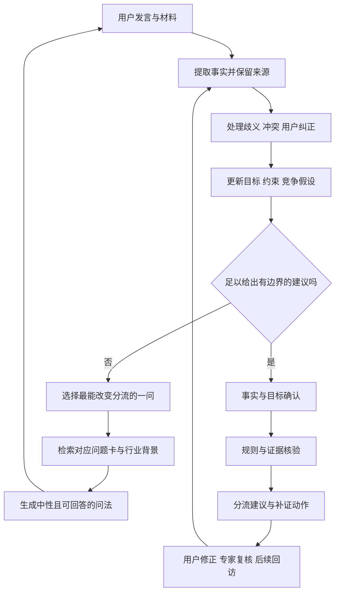

# FDE-Agent：企业 AI 转型分诊与专业访谈研究

研究日期：2026-10-01；2026-10-03 增补技术时效性、重大变化监测与更新机制研究。本文针对产品定位、专业知识沉淀和访谈设计；不实施应用改造。

**产品目标：帮助企业先判断，当前的问题是否值得花钱请 FDE，需要什么类型的帮助，以及请专家之前应该确认什么。** 最重要的交付物是经过用户确认的问题定义和有依据的分流建议。

**明确不做模型训练。** 本路线不包含持续预训练、SFT、LoRA、强化学习或训练医疗模型。专业能力优先来自经过审核的知识卡、案例、访谈策略、事实记录、分流规则与评测。用户纠正和专家反馈用于更新这些资产，不自动成为训练数据。

本文区分三种内容：可回查的来源事实；本地课程与研究报告中的经验；根据产品目标提出的设计方案。文中的问法、状态、分流路线、案例和验收门槛，除非另有注明，均为**本项目设计草案**，不是 Palantir 或阿福公开采用的同名机制，也尚未通过真实企业效果验证。

配套阅读：[高价值资料阅读笔记](research/高价值资料阅读笔记.md)、[资料目录与核验状态](research/资料目录.md)、[52 张访谈问题卡手册](research/访谈问题卡手册.md)。机器可读资产：[来源目录](research/source-catalog.json)、[访谈问题卡](research/interview-cards.json)、[12 个多轮分诊评测样例](research/triage-cases.json)。这些资产是可审阅的研究种子，尚未接入应用。

新增专题：[技术时效性与重大变化监测研究](research/技术时效性与重大变化监测研究.md)。其中包含数据源核验、定量筛选公式、诊断影响评分、知识／harness／模型分别更新的方案，以及按时间回放的评测设计。公式、权重和响应时限都是待验证的项目草案，不是现成行业标准。

## 1. 应该先建设什么

优先建设五样东西，顺序比模型选择更重要：

1. **分诊契约**：定义什么情况下建议自己学习、采用标准产品、先梳理流程、内部推进、请 FDE 探索，或者请安全与行业专家。
2. **问题发现协议**：从一次真实业务事件，追到流程、指标、数据、决策、责任和约束，知道每一步为什么问、什么时候停止。
3. **专业经验卡库**：保存“在什么情境下，问什么问题，哪些回答改变判断”，而不只是大段行业介绍。
4. **用户确认与证据记录**：明确区分用户陈述、材料证据、系统计算和顾问假设；能够纠正、撤回和追踪结论。
5. **访谈与分流评测**：检验下一问是否有用、是否误导、是否过早推荐昂贵服务、是否遗漏必须转交专家的问题。

还需要一条贯穿上述五项的能力：**技术时效性闭环**。IT 能力、价格、部署条件和标准产品覆盖范围变化，可能让以前需要定制 FDE 的任务转为标准产品，也可能使旧方案失效。应持续发现与验证这些变化，更新受影响的判断依据和评测；不能只等待用户反馈，或假定换新模型自然解决过时问题。本产品的重点是更频繁变化的技术供给与企业约束之间的匹配。

不宜先做全行业指标排行榜、全企业数字孪生或“大而全”的知识图谱。企业指标的统计口径差异很大；先掌握本企业基线和真实流程，比套一个来源不明的行业平均值更有用。图谱可以先用结构化卡片与关系字段实现，数据库选型后置。

## 2. 阿福对标：哪些能够确认，哪些需要纠正

### 2.1 将产品体验、模型能力、评测方法分开

本项目采用用户给出的对标关系：阿福帮助用户理解健康问题和寻求医疗帮助；FDE-Agent 帮企业理解 AI 转型问题并判断是否需要专业服务。**这是一项产品定位类比，不是企业管理与医学具有相同诊断标准的主张。**

公开模型项目、医疗评测论文和消费应用不是同一个对象：

| 对象 | 本次能够确认的内容 | 不能据此推出的结论 |
|---|---|---|
| AntAngelMed 模型项目 | 项目 README 公开介绍医疗模型及三阶段训练方法 | 阿福所有在线回答都由同一开源权重、同一版本和同一系统生成 |
| GAPS 论文 | 提出 Grounding、Adequacy、Perturbation、Safety 四个评测维度，并介绍指南锚定的评测构建方法 | 论文里的完整流水线就是阿福生产问诊架构 |
| 阿福应用 | 已阅读应用发布方说明，列出健康咨询、图片解读、健康档案和医疗服务衔接；官方网页部分只有前端壳 | 将应用简介当作独立临床评测，或将上一轮医生规模、把关比例和真实诊断准确率直接作为已证实事实 |

模型项目与评测论文原文可分别回查：[AntAngelMed 项目说明](https://github.com/MedAIBase/AntAngelMed)、[GAPS 论文 v2](https://arxiv.org/html/2510.13734v2)。应用功能依据 [阿福发布方应用说明](https://sj.qq.com/appdetail/com.antgroup.aijk.android)，不是疗效验证；各项阅读状态记录在配套资料目录中。

### 2.2 上一份报告需要撤回或收窄的说法

| 上一轮表述 | 本次核验与修正 |
|---|---|
| “GAPS 的 90% 一致率证明 AI 与医生诊断一致” | 原论文的 90% 和 Cohen's Kappa 0.77，是自动评测与专家评判的一致性；不是阿福临床诊断准确率 |
| “指南图谱、GRADE 和三跳检索就是阿福回答流程” | 这些机制出现在 GAPS 评测构建方法中；本次没有拿到足以证明其完整在线部署方式的公开材料 |
| “G4 上 GPT-5 得分 0.45，所以所有顶级模型都崩了” | 0.45 是该论文特定预览集、特定评分方法中的结果，不能外推为所有诊疗场景，更不是阿福与普通医生的全面比较 |
| “GAPS 开源后可以直接复用整条生成流水线” | 论文 v2 写明公开预览数据与评测代码，自动构建流水线及 DeepResearch rubric agent 将后续提供；应按实际仓库内容检查，不能预设完整工具已经可用 |
| “MedBench 分数、报告解读准确率证明超过一般医师” | 模型基准、特定任务评测、医生一致性、临床获益是不同指标；本次没有确认阿福全面优于一般医师的证据 |
| “可以直接用医疗开源模型做企业诊断” | 领域任务与知识不同；本项目明确不采用模型训练路线，也没有证据说明医疗模型适合作为企业分诊基座 |

原论文的公开预览集围绕非小细胞肺癌，包含 92 道题和 1,691 项评分细则；范围有限。上述修正依据论文的摘要、§3.6.3、结论及开放资源声明。见 [GAPS 原文](https://arxiv.org/html/2510.13734v2)。

### 2.3 不训练模型，仍然可以借鉴什么

**首先学“可拒绝给定论的专业交互”。** 可靠的初步判断应说明依据、尚未确认的条件，以及什么新信息会改变建议。让用户去补一份材料，可能比生成更长的报告更专业。

其次学评测的关注点。GAPS 将回答的深度、完备性、抗扰动与安全分别检查；它提醒我们，一个方向正确但漏了适用条件的答案，也可能造成误用。见 [GAPS 论文](https://arxiv.org/abs/2510.13734)。下面用于企业访谈的适配方案是本项目设计，而非医疗评分的直接迁移：

| 要解决的企业产品问题 | 系统应具备的行为 |
|---|---|
| 用户说“我们落后了，必须全面 AI 化” | 先问业务事件与实际影响，不把焦虑直接确认为转型需求 |
| 用户说“数据都有” | 追问数据能否关联、口径是否一致、能否按业务事件回溯 |
| 用户说“必须裁掉一半人” | 确认真正目标和能力缺口；不能把未经验证的节省工时等同于可裁岗位 |
| 用户不清楚财务损失 | 给出可测量的低成本动作，保留待定结论 |
| 用户的说法前后矛盾 | 对齐定义、时期、样本与角色视角，而非悄悄覆盖旧事实 |
| 系统建议请专家 | 给出具体触发原因和一页交接材料，让用户知道钱将用于确认什么 |

RAG 只能提供可用资料，不能保证推理与资料相符。需要逐项检查结论的证据是否支持它、适用条件是否匹配，以及是否存在反证。**有引用不是无幻觉，客户点头也不是因果已证实。**

其他医疗研究也不能替阿福证明效果。例如 AMIE 论文摘要报告的医生比较来自标准化场景下的文字对话，作者明确提示与常规临床实践不同；AMIE 与阿福也不是同一系统。见 [Towards Conversational Diagnostic AI](https://arxiv.org/abs/2401.05654)。企业产品同样要分清合成题表现、专家一致性与真实业务获益。

## 3. 本地资料与 demo：当前实际基础

### 3.1 本地材料不是两段摘要，而是一套可拆解的经验库

本轮直接检查了：

| 本地资产 | 检查结果 | 对本产品的价值 |
|---|---|---|
| [caojiang-md.zip](../caojiang-md.zip) | 253 个归档条目，其中 26 个 Markdown；23 讲正文，加开篇、结束语、结课测试 | 第 05、06、07、11、14、18、19–22 讲尤其相关 |
| [FDE 全景研究报告](../FDE全景研究报告-模式案例与落地操作手册.pdf) | 133 个 PDF 物理页；提取文本约 20.3 万字符，含目录和页眉 | 第 7 章售前与启动、第 8 章驻场、第 11 章面试、第 15 章反模式、第 20–21 章行业示例 |
| [课程 SOP](../knowledge/FDE课程关键经验与客户洞察-项目全生命周期SOP.md) | 已存在整理后的项目全生命周期经验 | 可作导读，但不能替代课程的完整上下文与案例 |
| `data/vectorstore.json` | 当前文件实际有 388 项；47 项来自 SOP，其余 metadata 主要为研究报告章节文件 `ch*.md` | 数量不等于来源多样性，也不能说明 23 讲原文已经完整进入索引 |

压缩包部分文件名使用旧编码，标准 ZIP 解码显示乱码；本轮恢复了可阅读的章节名。文档引用用“课程讲次＋章节标题＋官网链接”，正式入库还应记录归档成员名和内容哈希。

**本地报告中的“本报告框架”“教学样例”应原样保留来源属性。** 尤其是 PDF 物理页 82 的客户模拟题，不能包装成已核验的 Palantir 真题；报告第 7 章的一些问卷和评分也是综合设计，不是临床指南式标准。

### 3.2 课程中最值得转成问法的内容

| 来源 | 可沉淀的能力 | 应转成的访谈动作 |
|---|---|---|
| [第 05 讲：五天摸清真问题](https://time.geekbang.org/column/article/1002969) | 区分客户提出的方案、真实问题、客户有意保留的业务选择 | 最近一次事件；让实际操作者讲流程；追问为什么这样做；检查异常与人工补救 |
| [第 06 讲：场景与可衡量结果](https://time.geekbang.org/column/article/1002988) | 指标、价值链、优先级、采纳条件 | 谁的哪个业务结果要改变；先验证哪一小段；什么结果代表值得继续 |
| [第 07 讲：干系人与信任](https://time.geekbang.org/column/article/1003666) | 不同角色的动机与权力不同 | 谁执行、谁受益、谁批准、谁可能增加工作；不能只记录“老板支持” |
| [第 11 讲：评估驱动开发](https://time.geekbang.org/column/article/1005151) | 正常、异常和对抗场景；业务期望由业务方确认 | 用一个正常事件和一个异常事件检验判断；收集用户修正而非只收点赞 |
| [第 14 讲：私有知识](https://time.geekbang.org/column/article/1006738) | 把拒绝理由、取舍和默会知识沉淀下来 | 对用户否定建议追问原因；保存判断改变的上下文 |
| 第 18 讲：失败复盘 | 过度承诺、单点依赖、无复用、组织支持失效 | 历史尝试为什么没持续；谁不在就无法继续；谁负责后续维护 |
| 第 19–21 讲：行业篇 | 场景边界与行业约束不同 | 在具体业务风险和流程处追加行业问题，避免背一套统一问卷 |
| 第 22 讲：能力与面试 | 先澄清目标，再拆解问题，面对怀疑者先理解其顾虑 | 转成问题拆解和异议处理练习，避免背“标准答案” |

以上课程正文来自用户提供的本地文件。官网链接用于定位来源；部分课程可能需要订阅。不能把课程转述的外部统计自动升级为一手事实。

### 3.3 demo 的具体缺口

通过阅读 [schemas.py](../fde_agent/schemas.py)、[diagnose.py](../fde_agent/diagnose.py)、[prompts.py](../fde_agent/prompts.py)、[knowledge.py](../fde_agent/knowledge.py) 与 [config.py](../config.py)，可以确认：

| 现有机制 | 限制 | 与新定位对应的改造方向 |
|---|---|---|
| `FIELD_PLAN` 五阶段按字段顺序推进 | 画像后先问预算和拍板人，再挖真问题；容易变成售前资格审查 | 先了解事件和影响，再决定是否进入专家合作准备度 |
| `filled()` 判断非空即完成 | “不知道”“没统计”“暂无”也是非空，可能被当作已确认 | 事实状态应区分已陈述、待核实、不知道、不适用、冲突、用户确认 |
| `_merge()` 用新非空值覆盖旧值 | 没有纠错记录、证据出处、冲突保留和结论撤回 | 每次变更保留旧值、来源轮次、变更原因与影响的判断 |
| 提示词要求每轮 1–2 问、不得编造 | 这是有用的纪律，但缺少程序侧验证 | 问题选择、引用、数值和允许结论需要各自的检查 |
| 诊断时检索片段；报告时只传状态与历史摘要 | 报告没有收到检索证据包，仍被要求标注方法论出处 | 报告引用应由事实与来源 ID 生成并核验，不能让模型凭名称补出处 |
| 最后按场景输出做／延后／放弃 | 对应项目选型，尚未回答“是否值得请 FDE、请谁” | 增加独立的企业分流建议与确认条件 |
| 默认路径仍有 `C:\Users\...` | 在当前 Linux 环境，放在根目录的 ZIP 与 PDF 不会因存在就自动入库 | 后续实现时做可移植路径与来源盘点；本轮不更改索引 |
| 本地 `ingest()` 构建持久化向量库，配置选择模型；缺少外部变化监测与版本评测闭环 | 未见定时发现新技术、事实有效期、旧卡失效和候选模型回归机制；供应商模型别名也可能在相同名称下变化 | 建立变化事件、能力卡和版本清单；按影响范围分别更新知识、harness 或模型 |

当前确定性状态机能约束阶段顺序，**不能保证信息真实、问题有价值、所有必要条件齐备，也不能保证最终判断正确**。专业性需要落实到具体规则与验证，不能只依赖“状态机已经有了”。

## 4. 将三种组织形态变成可访谈的产品语言

“生产力改变生产关系”作为产品的组织转型假设，可以转成更具体的问题：个人工作变快之后，组织是否调整了决策权、交接、信息流、责任和监督？单纯统计 AI 工具使用人数回答不了这个问题。

| 用户提出的组织形态 | 可观察的表现 | 产品应判断什么 |
|---|---|---|
| L1：开始积极使用 AI 工具 | 个体使用助手解决文书、编码、分析等任务；工作方式仍主要依赖个人 | 能否通过学习、模板或标准产品改善当前问题 |
| L2：能够持续进化的 AI 组织 | 关键业务数据可关联；决策与执行有责任人；变更结果可观察；他人能够接手 | 是否需要围绕一个跨部门决策闭环做系统与流程改造 |
| L3：持续进化且有保障的 AI 组织 | 在 L2 能力上，建立按风险分级的权限、审批、评测、审计、回退和责任机制 | 高影响业务是否具备可验证的控制措施，缺口由谁补齐 |

这是产品内部成熟度草案，不是经过验证的行业标准。公司可能在不同业务域处于不同层级，例如营销 L2、采购 L1、付款环节需要更严格控制。不能给整个企业贴一个单一等级后推导所有动作。

**L3 应表述为“在约定风险边界内，有可验证保障的组织”。** “不会出现任何危险”无法作为产品或 FDE 的保证。风险控制也不应等到 L3 才开始；涉及敏感资料的 L1 工具使用同样需要适当边界。

Palantir 官方将 Ontology 解释为把数字资产映射到现实对象，并包含对象关系、行动和治理的组织运行层，用于支撑规模化决策。这为 L2 的“数据—决策—行动”理解提供参照，不能推导为每个企业都要先建设完整数字孪生。见 [Ontology 官方说明](https://www.palantir.com/docs/foundry/ontology/overview/)。

**规模是线索，不是分流规则。** 小团队也可能运行高风险、多系统业务；大企业也可能只需要一个标准文档助手。外部 FDE 通常在跨系统、业务特异、内部缺少推动力量时更有价值；已有合适内部团队的企业，可能需要内部 FDE 工作方式或短期评审，而无需长期外聘。

### 4.1 “以决策为核心”如何问出具体内容

Palantir 官方进一步将决策拆为 Data、Logic、Action、Security。见 [Why create an Ontology?](https://www.palantir.com/docs/foundry/ontology/why-ontology/)。将其适配为本产品问法：

| 维度 | 围绕同一次事件问 | 回答改变什么判断 |
|---|---|---|
| 数据 | “当时用了哪些信息？哪项无法确认？同一订单在不同系统能否对上？” | 信息不足、口径冲突，或已经具备可用数据 |
| 逻辑 | “为什么选这个办法？哪些规则稳定，哪些需要现场解释？” | 标准软件可覆盖，或需要梳理特异业务逻辑 |
| 行动 | “决定后谁在哪改了什么？后续还有哪些人工交接？” | 局部辅助，或跨系统执行与组织协同 |
| 安全 | “谁批准？做错能否撤回？谁会发现并接管？” | 常规可复核任务，或高影响需联合专家 |

这些问题不要求用户懂 Ontology。一次具体决策的输入、规则、执行和责任，比让用户评价“数字孪生完成度”更容易回答和查证。涉及自动行动时，可参考 [Action types 官方说明](https://www.palantir.com/docs/foundry/action-types/overview/)理解验证边界；实际控制仍需项目专业评审。

## 5. “怎么问”的核心：围绕一个真实事件建立共同理解

### 5.1 每次访谈最终要回答的六个问题

1. 当前存在什么具体问题？谁亲历，谁受影响？
2. 为什么现在值得解决？损失、机会或约束是什么？
3. 问题卡在人的任务、流程交接、数据、业务决策还是治理？
4. 有什么更便宜的办法？学习、标准软件、规则、流程调整、内部推进是否足够？
5. 外部专家的独特作用是什么？补业务发现、跨系统工程、组织推动还是风险控制？
6. 我们还不知道什么？哪份证据或哪位角色的反馈会改变判断？

专业访谈是逐步减少这些未知，而非把一个很长的表格全部填完。GOV.UK 官方访谈指南建议准备主题与追问、使用开放中性的问题、关注真实故事，并根据对话灵活深入。见 [Using in-depth interviews](https://www.gov.uk/service-manual/user-research/using-in-depth-interviews)。本项目将这些原则适配成以下流程。

### 5.2 推荐的开场与最初三轮

**第 1 轮：告诉用户这次能得到什么，再问一个具体事件。**

> 我先帮你判断这件事值得怎么投入。你最想改变哪件业务上的事？可以讲最近一次让你觉得麻烦、损失大，或者必须靠某个人救场的情况。

如果用户已经讲了事件，不再照念开场。其行业与角色可以从回答提取；缺少关键背景时再补问。

**第 2 轮：还原流程，而不是推荐方案。**

> 那次事情从哪里开始，到最后解决，中间经过哪些人？最久卡在哪一步？

用户觉得问题太大时，降为一个时间点：“你发现延误以后，第一步做了什么？”不要要求其一次描述全部企业流程。

**第 3 轮：确认影响及频率。**

> 这种情况大约多久发生一次？最直接的影响是多花时间、交付延迟、丢订单，还是其他事情？

用户没有数据时允许区间，区分估计与测量。先给用户一个可以继续讨论的问题轮廓，再解释为什么要找数字。

### 5.3 不同入口的分支

| 用户入口 | 第一问／追问 | 想区分的情况 | 何时转向 |
|---|---|---|---|
| “想上 AI”“怕落后” | “最近哪件事让你觉得现有做法撑不住？”没有事件时：“日常最耗时的是哪件重复工作？” | 具体痛点，还是学习与探索诉求 | 没有可指认的损失且任务局部：给学习／工具试用路径 |
| “要做 AI 客服” | “最近一单处理得很慢或没解决的咨询，具体卡在哪里？” | 知识问答、查订单、退款执行、异常裁决 | 要跨系统行动时追加权限与业务规则问题 |
| “老板要求数字孪生” | “老板希望哪个决策因为它变得更好？今天谁在做这个决策？” | 业务目标，还是架构口号 | 不能指向决策：先对齐目标；不要自动推荐数据平台 |
| “数据已经互通” | “拿一个具体订单，能否在不同系统找到同一条记录和一致状态？” | 系统有接口，还是业务语义真的一致 | 关联失败：追问标识、更新时点、口径和所有者 |
| “所有流程自动化” | “哪些动作做错后可以撤回，哪些会直接影响资金、客户或生产？” | 文书辅助与高影响执行 | 存在不可逆行动：提前进入风险与责任确认 |
| “以前做过但没人用” | “最近一次不用它时，大家改用什么办法？为什么？” | 技术效果、流程不合、激励、数据可信度 | 先查采纳障碍，避免重建相同工具 |
| “指标掉了，肯定是模型不行” | “哪个指标、哪段时间下降？同期数据、产品、人员或流程变过吗？” | 模型问题与其他变化 | 存在混杂因素：保留竞争假设，不能照单确认 |

### 5.4 下一问应怎样选择

每轮内部按如下顺序选题，最终只向用户提出一个主题中的 1–2 问：

1. 有正在发生的高影响失控迹象吗？先确认影响范围和当前责任人。
2. 用户上一句有关键歧义或矛盾吗？先澄清，避免在错误事实基础上继续。
3. 哪个未知最可能改变分流？例如“只需起草还是必须自动执行退款”通常比“年营收多少”更重要。
4. 用户是否有能力回答？业务负责人不会接口细节时，改问 IT 能提供什么材料，不无限追问。
5. 新问题是否已有答案、是否适用？已经说过的信息不重复采集。
6. 是否已足以给出低成本、可撤回的建议？满足时停止，不为了完成问卷而继续。

不需要现在就假设有准确的概率模型或给“信息增益”打小数分。先由专家审核可解释的分支，再记录每问是否实际改变判断，逐步优化选题。

## 6. 追问协议：事实、流程、决策、例外、价值、责任

下面是内部覆盖表，按需要选择，不应一次全部呈现给用户。

| 主题 | 推荐问法 | 继续追问的触发条件 | 允许推进的最小信息 |
|---|---|---|---|
| 事实 | “请讲最近一次。” | 回答一直是“通常”“大家都觉得” | 一次事件，或明确标注尚无具体事件 |
| 流程 | “从收到任务到完成，经过哪几步？” | 只讲理想 SOP | 实际路径；至少一个等待或返工点 |
| 决策 | “这一步需要判断什么？依据是什么？” | 只描述数据搬运，不知道搬完做什么 | 决策者、输入、判断、行动、反馈 |
| 数据 | “那次判断用的信息在哪里？能否关联起来？” | “都有数据”，但无法回溯具体事件 | 来源、口径、关联方式、可取样性 |
| 例外 | “上次按正常规则处理不了，最后怎么解决？” | 流程看似全规则化 | 常见异常、裁决者、恢复办法 |
| 业务选择 | “现在这一步保留下来，是为了满足什么要求？” | 某一步看起来重复或低效 | 必须保留的控制或客户约束 |
| 价值 | “这个问题反复发生，实际影响哪项结果？” | 只有工时，尚无业务影响 | 数量级、口径、受益方；允许待测量 |
| 历史 | “之前试过什么？哪里好用，哪里停了？” | 用户要求直接重建 | 已尝试路径与停止原因 |
| 内部能力 | “若先改这一小段，谁能持续负责？” | 默认外部服务才是解法 | 业务 owner、可投入时间、可借用能力 |
| 治理 | “哪个动作必须经过人确认？做错怎么撤回？” | 系统拟执行资金、对外或生产动作 | 权限、批准、回退和当前责任人 |
| 采纳 | “用起来以后，谁的工作会增加或减少？” | 负责人赞成，一线抵触 | 用户反馈、激励冲突、维护者 |
| 确认 | “我理解的重点是……有哪里不准确？” | 准备给出分流 | 用户对事实摘要、目标与边界的修正 |

### 6.1 用竞争假设决定追问

例：“交付慢”至少可能涉及需求频繁改变、排产资源约束、库存信息迟到、审批等待、供应商波动和指标定义不一致。它们可以共存，不宜强行做彼此完全互斥的树。

| 暂时假设 | 能区分它的追问 | 新信息如何影响判断 |
|---|---|---|
| H1：大量工作只是重复整理信息 | “信息整理完以后，后续决策通常能按明确规则执行吗？” | 若是且仅涉及局部任务，标准工具／内部改进可能足够 |
| H2：跨部门数据不能支撑同一个决策 | “最近那次，各部门对同一订单的状态一致吗？” | 若不一致且损失重大，FDE 发现与工程整合更有价值 |
| H3：业务规则与权责冲突 | “信息都给齐以后，谁能决定优先级？不同部门是否接受？” | 即使数据齐全仍无法决策，应先做流程与权责对齐 |
| H4：关键经验只在某个人身上 | “那个人不在时，哪一步停止？其他人有没有可用依据？” | 需要知识与交接；是否请 FDE 取决于流程范围及系统依赖 |
| H5：AI 行动权限过大 | “系统能直接修改什么？谁审核，如何恢复？” | 需要专业治理评审；不能仅按 ROI 排序 |

“鉴别诊断”在企业产品里意味着保留替代解释、主动找反证，并指出证据能支持到哪里；不意味着给每个病因编一个精确概率。

### 6.2 数字必须带定义

记录“每单 10 分钟”时，需要知道：哪类单、哪段流程、哪个时期、样本量、手动耗时还是等待时长、数据来源。记录“报废率 8%”时，需要确认分母、返工是否算报废、产品结构和检验环节。

行业基准使用前应核对行业子类、地区、规模、时期、口径和样本。缺少可比基准时输出“尚无可比行业基准，建议建立本企业基线”，不能把其他公司的营销案例提升幅度当作客户保证。

## 7. 不同行业与不同角色如何追加问题

### 7.1 行业问题围绕业务事件与失败代价

| 行业／场景 | 先抓哪件事 | 关键追问 | 可能改变的分流 |
|---|---|---|---|
| 制造：交期／排产 | 最近一次延期订单 | 哪一步首先偏离计划？订单、物料、设备、工艺版本能否关联？临时插单谁批准？ | 一个人整理表格可工具化；跨 ERP/MES/WMS 与现场约束可能需要 FDE |
| 制造：质量 | 最近一次漏检或返工 | 缺陷如何定义？按批次、工序还是成品统计？误判的代价？是否必须现场复核？ | 可能需要工艺／质量专家；不能自动把质量问题归为大模型问题 |
| 零售／电商：库存 | 最近一次缺货或积压 | SKU、门店、仓库、促销与退货能否对齐？是谁决定补货？ | 标准库存功能先评估；多方决策和数据关联困难时再考虑 FDE |
| 客服 | 最近一单转人工或处理失败的工单 | 是缺知识、缺实时订单信息、不能执行动作，还是涉及例外裁决？ | FAQ 工具与跨系统执行助手应分开评估 |
| B2B 销售／专业服务 | 最近一次报价、标书或交付返工 | 内容整理和实际判断各耗时多少？谁校验数字与对外承诺？ | 文档辅助可局部试点；多系统事实与对外责任需额外审核 |
| 金融：审批／交易／授信 | 最近一次异常或需人工复核的决策 | 谁授权、谁有权覆盖决定、如何留证、什么动作不可逆？ | 根据具体用途引入风险与合规专家；行业标签本身不是紧急信号 |
| 医疗／政企：资料与业务系统 | 最近一次查询或交接错误 | AI 是整理材料、辅助判断还是直接改变现实流程？材料范围与授权是谁定的？ | 对高影响决策转交具备相应行业能力的专家 |
| 能源／工业设备 | 最近一次异常处置 | 告警到现场行动多久？传感器状态可信吗？现场谁可以停机或接管？ | 工程与现场专业人员参与；先理解物理约束 |

这些行业问法是设计草案。具体法律义务、检测阈值和技术方案需在项目、地域和用途明确后由相应专家核实；初筛不能凭行业名生成固定处方。

### 7.2 同一件事，向不同人问不同问题

| 角色 | 重点 | 示例 |
|---|---|---|
| 企业主／业务负责人 | 目标、损失、优先级、组织投入 | “这件事不改，未来一个季度最直接的后果是什么？” |
| 一线操作者 | 实际路径、人工补救、例外与采纳 | “最近一次遇到它，你先打开了什么，后来又找了谁？” |
| IT／数据负责人 | 系统、标识、口径、接口、质量、部署与维护 | “同一业务事件在这些系统里如何关联？哪些数据能用于取样验证？” |
| 财务负责人 | 净收益、成本、归因、兑现方式 | “省下的时间将减少外包、支持更多业务，还是只是工作变轻松？” |
| 安全／合规负责人 | 高影响动作、控制、证据和责任 | “允许 AI 做到哪一步？哪一步必须人签字，怎样审计和回退？” |

一个受访者的回答可以支持初步分流，但通常不能替代所有角色。不要因“老板说没问题”而把一线采纳、数据可用性和权限范围标为已确认。

## 8. 怎么确认、怎么对齐：三次收口和冲突处理

### 8.1 第一次：确认发生了什么

> 我理解最近那单延误时，大家先花时间核对三套状态，再等主任定优先级。你说的两天主要是等待，并不是两天一直在做表格，对吗？

只确认事实，给用户明确可纠正的对象。不要在一句“对吗”里同时夹带病因和高价服务建议。

### 8.2 第二次：确认要改善什么，哪些约束必须保留

> 你更关心的是提前发现会延期的订单，而不是把所有审批都取消。我们先保留主任的最终调度权，判断能否减少核对信息的时间。这个方向符合你现在的优先级吗？

分开记录目标和范围。用户同意目标，不代表同意未来方案、预算或效果承诺。

### 8.3 第三次：确认判断、依据和未知

> 目前更像跨系统信息和排产决策衔接的问题，已有标准工具能否覆盖还没确认。建议先让业务和 IT 各提供一单正常、一单异常的流程与字段样例，再判断是否值得请 FDE 做有范围的探索。如果这些记录已经能自动关联且规则稳定，建议会转向内部推进。

最终收口包括：当前建议、支持它的事实、替代路径、尚未确认的条件、会改变建议的证据、下一步谁做什么。这样用户不仅知道结论，还知道如何证伪结论。

### 8.4 出现矛盾时不要强选一个答案

例如老板说“数据已互通”，IT 说“月底仍需 Excel 对账”。应追问：

> 这里的“互通”是指系统能够导出，还是日常就能按同一订单自动关联？月底对账主要在补什么差异？

然后检查：是否不同时间段、不同业务域、统计口径不同，或“正常路径已通、异常仍靠人”。如果暂时不能解释，两条陈述都保留为冲突，给出需要哪位角色或哪份样例核验。

用户纠正“不是 50 万损失，是 50 万销售额”时，应撤回基于损失做的经济判断，更新相关摘要，并向用户说明当前分流是否改变。不能只修改一个字段，保留旧的投资建议。

## 9. 如何专业判断“要不要花钱请 FDE”

### 9.1 区分必要性、准备度、紧迫性

| 维度 | 判断内容 | 常见误判 |
|---|---|---|
| 必要性 | 是否有足够重要、标准工具难覆盖、内部难以持续推进的问题 | 企业人数多／想上 AI，就认为需要 FDE |
| 准备度 | 能否安排业务 owner、样例数据、访问方式、反馈与探索边界 | 无法立即给生产权限，就认为永远不值得请 FDE |
| 紧迫性 | 是否正在造成重大影响，或者高影响系统已经缺少控制地运行 | 强监管行业都标“紧急”；或低风险事项因老板催促而标“紧急” |

数据不足可能正是需要短期 FDE 发现的原因。因此，“有必要，但先确认访问与数据口径”是一种合理结论。完全没有业务目标、且组织不愿提供任何核验条件，则暂不进入技术实施。

### 9.2 六条主要分流路线

| 路线 | 适用线索 | 输出与下一步 |
|---|---|---|
| R0：学习与自助工具 | 痛点局部、可撤回；内部有人可以学习；无需复杂集成 | 用真实小任务试用，记录耗时与错误；说明什么情况需要再评估 |
| R1：标准软件／已有功能 | 问题常见、规则清楚、产品已有成熟能力 | 先检查现有软件、标准产品与实施支持，再比较定制服务 |
| R2：流程／数据／权责先对齐 | 目标、口径或责任冲突成为主要阻塞 | 由业务 owner 组织必要角色对齐；必要时请流程／领域顾问，而非直接写 AI 系统 |
| R3：内部团队推进或短期专家评审 | 内部能力和责任人已具备，问题范围可控 | 形成小范围验证与验收标准；补专项评审，不默认长期外聘 |
| R4：请 FDE 做有范围的发现与验证 | 影响较大、跨流程／系统、业务特异；标准路径难覆盖或内部无足够推进能力 | 先购买边界清晰的发现与验证，明确产出、费用范围、暂停条件和后续决策 |
| R5：具备安全／合规／行业能力的专家联合介入 | 高影响动作或控制缺口需要专业判断 | 业务、工程和对应风险专家共同界定边界；正在失控时先联系当前负责人处理 |

另设 `needs_evidence` 状态：关键条件未确认时给**暂定方向＋最少补证动作**，不能硬选确定路线。路线可组合，例如 R4 需要 R5 专项评审；R2 完成后可能进入 R3 或 R4。紧迫性单独记录，避免混淆“找什么人”与“多久行动”。

### 9.3 推荐 FDE 的门槛应有解释，而非只给总分

推荐 R4 至少应能说明：

- 正在确认的业务问题是什么，影响的数量级或重要性依据是什么。
- 为什么学习、规则、现有软件与标准产品未必足够。
- 外部 FDE 预计补哪项内部缺口。
- 最小发现范围是什么，什么证据会支持继续或停止。
- 谁参与确认，尚缺哪些条件。

暂不需要把这些做成“超过 75 分就请专家”的自动规则。任意权重会制造精确感，并掩盖强制条件。待真实案例积累后，再检验哪些信号对专家判断确有区分力。

### 9.4 经济判断：省下工时并不等于现金收入

可先分三种价值：减少实际费用；增加可承接业务／减少损失；改善风险与质量。每项分别记录来源、测量方法和不确定性。

一个可供财务讨论的结构是：

```text
可兑现净收益 = 经确认的可实现业务收益
              - 外部服务与软件费用
              - 内部人员投入、集成、迁移、培训和持续维护成本
```

这不是当前就能填满的预测模型。诊断阶段可以用范围和情景，不能从“每月省 100 小时”直接推出“值得投入 100 万”或承诺回本期限。高影响风险事项不能因预计 ROI 低而省掉必要的专业处理。

## 10. 四段完整示例：展示问法与判断改变

以下全部是本项目合成教学案例，不是真实客户访谈，不应作为行业统计或未经审核的黄金答案。

### 10.1 小团队：无需昂贵 FDE

**用户**：我们 8 个人，都在用 AI，是不是还该请 FDE 做 AI native？

**Agent**：你现在最想解决哪件具体事？可以讲最近一次让大家明显耗时的情况。

**用户**：每周整理客户邮件和会议纪要，大约两三个小时。

**Agent**：整理完主要供内部查看，还是会自动发给客户、改订单或做其他决定？

**用户**：内部看，最后还是负责人检查。没有接其他系统。

**Agent**：现在谁愿意把模板和检查方式维护起来？之前用现有工具试过吗？

**用户**：运营同事可以，工具已有，只是没有统一用法。

**确认**：主要缺口是模板与使用规范，任务局部、可检查，已有内部负责人。**分流**：R0／R1。先用现有工具完成两次真实任务，记录整理耗时、漏项与人工复核时间；若以后需要跨系统执行对外动作再复诊。结论不是由“8 个人”单独决定。

### 10.2 成熟制造企业：值得请 FDE 做发现，但病因待确认

**用户**：我们交付总拖，想用 AI 排产。

**Agent**：最近一次拖期订单，从发现问题到调整计划，具体经过了什么？

**用户**：销售、仓库、车间核对了两天，最后主任重新排了一遍。

**Agent**：两天主要是在确认订单和物料状态，还是状态清楚但不知道怎么排？

**用户**：两种都有。ERP、仓库表、车间记录经常不一致。

**Agent**：拿同一订单，三处能按同一个编号找到记录吗？哪些差异是更新延迟，哪些需要人解释？

**用户**：订单编号能对，但物料替代和临时插单靠主任。每月都遇到。

**Agent**：过去有没有试过现有系统的排产功能？停在什么地方？

**用户**：试过，现场插单和替代规则套不进去。IT 没人长期跟业务梳理。

**确认**：目前至少有状态口径和例外决策两个假设，尚不能断言缺“更强模型”。**分流**：暂定 R4，先确认损失数量级、业务 owner 和可核验样例；首阶段只覆盖一个产品族或一类订单。人工调度权保留，发现阶段决定是否继续实施。

### 10.3 企业已有工具：主要问题是组织约束

**用户**：知识库上线半年，没人用，想换个 Agent。

**Agent**：最近一次员工没用它而去问人的情况，问了什么，为什么不用？

**用户**：客户例外折扣。Agent 给标准政策，但审批人经常临时改。

**Agent**：这些例外会写回政策或系统吗？员工按标准政策执行后，谁承担结果？

**用户**：没记录，还是问总监最保险。

**确认**：知识检索之外还存在例外规则与责任不清。**分流**：R2，先建立例外记录、批准责任和政策更新方式；然后评估原系统能否覆盖。不能凭“没人用”推断必须重做技术。

### 10.4 小公司高影响业务：规模小也需要专业保障

**用户**：我们人不多，想让 AI 直接审批付款，省人力。

**Agent**：目前是生成付款草稿，还是可以直接批准和执行？金额范围和最终确认由谁控制？

**用户**：准备让它直接付，规则还没定；财务说之后再补。

**Agent**：这项功能已经在真实付款里运行了吗？当前谁负责授权和异常接管？

**用户**：还没上，老板负责。

**确认**：高影响行动尚未运行，审批与控制条件未定义。**分流**：R5，先由财务、工程与对应风险专家界定审批、权限、审计和回退；不因公司小而建议自行全自动上线，也不将“未上线”误报为正在发生的事故。

## 11. 怎么把互联网资料沉淀成专业能力

### 11.1 资料短缺需要按任务扩展搜索范围

直接叫“FDE 经验”的文章只是一个入口。至少同时搜以下资料，它们分别补不同的知识空白：

| 资料类型 | 重点搜索内容 | 可以解决什么 | 使用限制 |
|---|---|---|---|
| Palantir 官方与一线岗位记录 | FDSE、Deployment Strategist、decomposition、业务对象、决策与行动 | 从业务发现到工程实现的职责与协作 | 官方案例可能偏成功叙事；流程、失败和成本细节未必公开 |
| FDE 第一人称复盘 | 开始误判了什么、哪次客户反馈改变方向、数据与组织阻力、交付后维护 | 有价值的追问触发器和失败机制 | 标注作者经历、具体上下文；个案不能当全行业规律 |
| 咨询公司官方完整 case | 目标澄清、拆解、定量材料、备选路径、综合建议 | 结构化问题与取舍方式 | case 是教学场景，信息通常更整齐，不能照搬为真实访谈 |
| 候选人第一人称详细面经 | 面试官角色、完整问题、候选人问了什么、怎样被追问、反馈 | 客户模拟和问题拆解 | 未核验身份／仅有题目列表的质量更低；通过率和轮次比例常无可靠依据 |
| 企业项目复盘与采用失败 | 系统上线后为何不用、口径、责任、使用环境、维护成本 | 纠正“技术可运行就等于业务有效” | 看基线、范围与后续，不只看宣传提升百分比 |
| 用户研究与业务发现协议 | discussion guide、contextual inquiry、problem framing、assumptions | 提问与对齐的基本纪律 | 通用方法应经过 FDE 业务情境适配 |
| 行业流程与规则资料 | 指标定义、实际工作流、例外、行业控制 | 行业细节追问 | 只采用有来源、版本与适用范围的指标和规则 |

不要给每篇文章一律同样权重。材料是否能定位具体事件、是否有原始证据、是否说明条件和反例，比“名气大”更重要。

### 11.2 建议的搜索词与原文阅读方式

本轮不仅搜到链接，也直接读取了以下高价值材料。详细的来源分析、提问改写与使用边界见 [阅读笔记](research/高价值资料阅读笔记.md)。

| 已阅读来源 | 对“怎么问”的贡献 | 使用边界 |
|---|---|---|
| [微软：Envisioning and Problem Formulation](https://microsoft.github.io/code-with-engineering-playbook/ml-and-ai-projects/envisioning-and-problem-formulation/) | 目标、可测量结果、当前办法、领域专家、数据、使用与维护责任，形成共享问题定义 | 工程发现协议，需要适配初步分诊的负担与范围 |
| [First Round 的 FDE 招聘与从业者访谈](https://review.firstround.com/so-you-want-to-hire-a-forward-deployed-engineer/) | 业务与技术双重发现；受访者回忆的客户模拟；何时其他实施支持已经够用 | 主要讨论供应商建团队，不可直接迁移成客户购买门槛 |
| [Baseten：FDE on the frontier of AI](https://www.baseten.co/blog/forward-deployed-engineering/) | 探索模糊问题、共同交付、产品反馈与职责边界 | 公司经验，不是全行业统一职责或比例 |
| [Baseten：一名 FDE 的工作复盘](https://www.baseten.co/blog/what-i-learned-as-a-forward-deployed-engineer-working-at-an-ai-startup/) | 真实生产条件、性能与成本约束、交接 | 个人工作内容与时间分配不可普遍化 |
| [Baseten：Joey Zwicker 访谈](https://www.baseten.co/blog/joey-zwicker-joins-baseten-as-head-of-fde/) | 共创、取舍、可信承诺与异常沟通 | 受访者经验，仍需具体企业验证 |
| [Bain：Coffee Shop Co.](https://www.bain.com/careers/hiring-process/interviewing/coffee-case-study/) | 从是否值得投入开始，澄清范围、收益与成本，给条件建议 | 官方教学案例；未将图表数字引入产品规则 |
| [Bain：FashionCo.](https://www.bain.com/careers/hiring-process/interviewing/fashion-case-study/) | 病因探索与方案比较分开，最终说明风险和下一步 | 简化练习不等于真实行业基线 |
| [FDE 详细问题库](https://github.com/aishwaryanr/awesome-generative-ai-guide/blob/main/interview_prep/roles/forward-deployed-engineer/questions.md) | 99 个展开项，尤其第 85–99 题的问题拆解与客户异议情境 | 作者编写的准备材料，不是已核验的亲历面经或官方标准答案 |

本轮未取得部分 Palantir 官方面试博客、个人复盘网站与 McKinsey case 的正文。它们保留为候选；详细案例分析采用实际读到的 Bain 材料，不根据标题补写内容。

```text
"forward deployed engineer" "discovery" "customer"
"deployment strategist" "workflow" "decision"
"Palantir" "decomposition interview" "experience"
"decomp interview" "clarifying questions"
"forward deployed" "postmortem" "adoption"
"AI implementation" "lessons learned" "business owner"
site:mckinsey.com/careers/interviewing Diconsa
site:mckinsey.com/careers/interviewing Beautify
site:microsoft.github.io/code-with-engineering-playbook design
FDE 进场 真问题 失败复盘 数据口径
咨询 客户访谈 真实流程 异议 目标对齐
```

搜索结果摘要只用于找到原文。拿不到正文的资料留在“候选／待核验”区，不生成确定规则，不把摘要写成已阅读全文。详细面经优先保存“追问路径”，而非收集一百个题目名。

### 11.3 将资料转成六类资产

1. **来源卡**：作者、机构、发布日期、访问日期、原文链接、类型、阅读范围、核验状态、许可与适用边界。
2. **问题卡**：触发情境、问题、为什么问、可区分的假设、回答分支、确认动作、停止条件。
3. **模式卡**：一个常见失败或业务障碍；附支持证据、反例、不能外推的范围。
4. **案例卡**：业务上下文、原始诉求、追问、新证据、判断改变、实际结果与未公开部分。
5. **指标卡**：定义、分子分母、时间窗、数据来源、计算方式、可比范围，不只存一个数字。
6. **评测卡**：已知事实、允许的结论、必须追问、不可编造内容、用户修正、预期分流与待专家确认项。

课程第 14 讲提供了经验抽取与用户拒绝反馈的启发。对本项目而言，沉淀的目标是知识与流程更新；不采用模型训练。来源见 [曹犟：私有知识](https://time.geekbang.org/column/article/1006738)。

### 11.4 一篇文章如何加工：实际可执行的流程

```text
找到原文 → 登记来源与访问状态 → 标出事件／判断／边界
        → 起草经验卡和追问卡 → 回查每条事实与来源
        → 专家审核可用性和反例 → 加入访谈检索与评测
        → 收集失败和用户纠正 → 更新卡片与版本
```

必须做的检查：把作者亲历、作者转述与加工者推论分开；将不同网站转载同一案例合并为一条证据链；保留失败与反例；避免把描述性结论直接转换为普遍阈值；保存原文定位，但不默认有权复制公开资料全文或发布用户提供的付费课程。

来源状态可以为 `reviewed_primary`、`reviewed_firsthand`、`reviewed_local`、`reviewed_secondary`、`partial`、`candidate_unverified`、`inaccessible`。这些状态描述阅读与出处，不代表其结论一定真实。规范、实测数据、口述、营销案例要分别核对可信度与适用性。

对快速变化的技术供给，还需保存来源发布时间、变化实际生效时间、首次观察时间、验证时间、适用版本和重新检查时间。原文重新抓取不代表其中的旧声明重新成立；同一发布被 X、新闻与博客转载，也不是三份独立证据。具体事件与能力卡结构见[技术时效性专题第 5 节](research/技术时效性与重大变化监测研究.md#5-怎样更新知识harness-和模型)。

### 11.4.1 公开资料之外，如何采集专家真正的判断经验

请专家复盘一个能回看材料的真实项目，逐步问：客户最初说什么；你最先怀疑什么；第一问与第二问为何这样选；哪个回答或材料改变了判断；如何排除其他解释；为什么便宜办法不够；怎样确认理解；哪些事仍然不能确定；后续结果有没有兑现。

再做一个关键反事实：“如果客户当时的这个回答相反，你会怎样改变下一问和建议？”这比请专家泛泛总结原则，更容易形成访谈分支。口述、原始材料和加工者推断分别保存。完整协议与卡片示例见 [阅读笔记第 8 节](research/高价值资料阅读笔记.md#8-公开经验不够时怎样把专家的判断过程问出来)。

### 11.5 为什么面试材料有帮助，怎样避免误用

有价值的客户模拟包含：“客户说了什么—候选人为什么问—得到什么新条件—方案如何收缩—客户哪里反对”。缺少这些内容的“必考题＋模板答案”通常只能帮助表达，不能训练专业判断。

从面经到知识卡的推荐记录：

| 字段 | 记录要求 |
|---|---|
| `provenance` | 官方练习／候选人亲历／作者改编／来源不明，不能混写 |
| `client_request` | 保存客户最初的模糊诉求 |
| `clarifications` | 哪些澄清改变了目标、范围或限制 |
| `missing_real_world_checks` | 面试省略了哪些实际数据、角色和采用问题 |
| `decision_change` | 新回答为何使判断改变 |
| `transferable_question` | 改写成中性、具体的客户问法 |
| `counterexample` | 何时这套问法／判断不适用 |

本地第 22 讲与 PDF 第 11 章可以作为首批材料。后续新面经通过上述结构审核后再入库；不能因本地报告引用过某 GitHub 题库，就声称题库中的权重、通过率或“秒拒”规则得到 Palantir 官方确认。

## 12. Agent 如何使用这些资产，避免只做检索问答

### 12.1 六种状态需要分开记录

| 状态 | 记录什么 |
|---|---|
| 企业与业务背景 | 行业、业务域、受访者角色、规模背景、目前诉求 |
| 事实与材料 | 用户原话、来源轮次、事件、数字口径、证据、冲突、确认情况 |
| 目标与限制 | 想改变的业务结果、必须保留的约束、可投入能力 |
| 竞争假设 | 支持／反对证据、尚需验证的区分条件；不伪造概率 |
| 访谈计划 | 已覆盖主题、下一问、问的原因、跳过原因、需要其他角色提供的材料 |
| 分流结论 | 暂定／可发布方向、依据、替代路径、紧迫性、缺失条件、重启与撤回条件 |

不建议继续用一个非空字符串同时代表“客户说了”“我们核实了”“结论已确认”。也不建议把模型的自信表述当可靠性分数。

### 12.2 推荐的处理流程



用于问题选择的是问题卡，不是任意相似长段落。用于支撑事实和方法的是来源卡与案例卡。用于企业判断的是当前企业证据。知识库方法论不能代替客户数据证明当前病因。

### 12.3 引用应该绑定到具体结论

每条结论至少指向一种依据：

- `user_statement`：用户陈述，附轮次与确认状态。
- `provided_artifact`：用户材料，附时间窗、口径与定位。
- `computed_result`：程序计算，附输入、公式和单位。
- `external_reference`：适用的外部资料，附来源 ID 与范围。
- `working_hypothesis`：顾问推断，附支持、反证和验证动作。

证据不是一条固定排行榜。客户实际数据也可能失真、过时或口径不一致；外部权威方法也未必适用于这家公司。判断证据时同时看来源可靠性、相关性、时间、覆盖范围和独立性。

最终报告先由程序编排可引用的证据包，再让模型解释，并检查所有数字、来源 ID 与分流理由。资料只说明“跨系统整合可能困难”时，不能写成“你们一定存在严重数据孤岛”。

### 12.4 新增痛点：静态知识、harness 与模型跟不上技术供给

**“重大变化”应定义为：经证据确认，在某类企业任务与约束下，足以改变可行方案、投入边界、关键追问或分流建议的技术事件。** 社交热度用于发现候选；任务表现与企业适用条件决定是否进入诊断。它既可能是新能力出现，也可能是服务下线、部署条件变化或旧能力失效。某个客户的小变化，也可能改变该客户的判断，不必先成为全网热点。

本项目推荐两级筛选，完整计算与合成算例见[专题第 4 节](research/技术时效性与重大变化监测研究.md#4-怎样定量判断重大变化)：

1. **变化雷达**：按技术实体／版本聚合，去转发与重复，比较同源历史基线，计算热度异常；同时订阅官方发布和服务状态，补足“低热度但高影响”的事件。
2. **诊断影响评审**：确认原始发布、实际可用性与任务测试，量化新增可行任务、质量／总成本／延迟等约束跨越、集成与部署适用性、对既有选项的替代程度；结合固定代表场景的“决策影响覆盖率”，输出证据状态、影响范围和建议动作。

| 更新对象 | 何时需要变 | 推荐路径 |
|---|---|---|
| 知识与能力卡 | 技术事实、产品覆盖或可用条件改变 | 自动采集与起草；验证后发布带有效期和替代关系的卡片，撤回失效断言 |
| harness：提问策略、规则、检索、工具与校验 | 新事实使原有问题或分支遗漏关键条件 | 生成受限候选变更，回放访谈与分流评测，再灰度；不得把帖子直接当作执行指令 |
| 基座模型 | 当前模型在新任务上存在可重复能力缺口，或候选在质量与成本约束下更合适 | 在同一知识、工具和样例条件下比较候选模型，独立回归后换版；不依赖榜单或热度自动切换 |

首版优先采用**后台定时监测＋发布前按需核验＋版本化能力卡**，并保留专家审核。DSPy 与 GEPA 可作为后续离线提出提示词／策略候选的路径；它们不能替系统补齐未发现的事件，也不能证明本项目的分诊质量。见 [DSPy 项目说明](https://github.com/stanfordnlp/dspy)、[GEPA 论文摘要](https://arxiv.org/abs/2507.19457v2)。保持“不训练模型”的边界，只研究提示词与策略优化。

一次会话固定知识、harness、模型和工具版本；中途遇到重大失效，明确标记相关结论待核验，建立有记录的新版本。报告注明“技术选项核验截至何时”，以及哪些新条件会重启诊断；不只记录报告生成日期。

## 13. 怎样验证 Agent 已经会问，而不是只会说

### 13.1 首批评测覆盖什么

先做一小批可讨论的样例，再取得独立专家审核。合成案例用于暴露缺口，不能因模型生成了参考答案就称“黄金案例”。配套 `triage-cases.json` 是草案。

覆盖以下类别：自助即可、标准软件足够、内部团队可推进、主要是权责冲突、适合 FDE 探索、高影响需联合专家、证据不足、用户焦虑、过往 AI 失败、数据口径矛盾、用户纠正金额、故意诱导过度承诺。

### 13.2 同时评估访谈过程与最终分流

| 维度 | 检查问题 |
|---|---|
| 问题发现 | 是否从模糊技术诉求得到具体业务事件？是否理解用户实际要改善什么？ |
| 下一问价值 | 是否问了能区分替代解释的问题？问题得到答案后是否改变了判断？ |
| 中性与可回答性 | 是否诱导用户认同“必须请 FDE”？是否让不懂接口的人回答不可答问题？ |
| 完备性 | 是否遗漏范围、内部替代、风险、责任或决定性的未知？ |
| 纠错能力 | 用户修正事实后，相关判断是否撤回并重新生成？ |
| 证据忠实度 | 引用是否确实支持结论？是否把猜测升级为客户事实？ |
| 分流质量 | 必要性、准备度和紧迫性是否分开？是否推荐了合理替代路径？ |
| 交接质量 | 专家能否据此知道要找谁、看什么、验证什么？ |
| 用户成本 | 重复问题、无关问题、放弃率与对话负担如何？ |

固定给系统一个完整案例只能评估末端答案。多轮评测要让受访者模拟器根据问题释放信息、能够回答不知道和纠正；并保留人工真实访谈测试。模拟器与被测系统共享知识可能使评测过于容易，应让独立专家检查情节与答案。

### 13.3 必须分别统计的错误

- **过度转介**：本可自助或用标准工具，却推荐昂贵 FDE。
- **漏转介**：实际有重要系统或治理缺口，却说“自己学一下就好”。
- **错误服务类型**：主要需要业务流程或专业风险评审，却推荐模型开发。
- **过度确定**：关键证据缺失时仍发布病因、收益或紧迫性定论。
- **伪造依据**：编造企业事实、案例效果、行业阈值或出处。

不要只统计专家一致率；没有真实后续证据时，两位专家也可能一致误判。按行业、角色、风险与信息充分程度分层报告结果，复核分歧，并回访建议执行后的实际变化。

### 13.4 首版发布条件：作为内部目标而非已有成绩

推荐先采用以下设计门槛，真实阈值需结合试用与专家样例调整：

- 每条公开建议都能定位到事实、推断或方法来源；未知不得静默补全。
- 用户金额、口径、责任人纠正能够引起相关判断重新检查。
- 对关键条件不全的样例允许 `needs_evidence`，不强迫确定答案。
- 发布前检查的测试集里不得出现伪造企业数据、保证转型收益、跳过高影响责任边界等重大错误。
- 自助和标准产品案例必须得到足够覆盖，避免形成转介销售偏差。
- 独立专家抽查多轮过程与交接卡，而非只让同一个模型给自己打分。

“测试中零重大错误”不代表现实中零风险。它只是一项最低发布检查，仍需版本回归和后续反馈。

### 13.5 在 GAPS 借鉴维度之外，独立评测时效性 T

这里的 **T（Timeliness）是本项目新增维度，不是蚂蚁官方 GAPS 的扩展标准**。它衡量“以决策时点已经存在的证据，是否及时改变受影响的建议，同时保持未受影响建议稳定”。不能用引用发布日期或新模型名称替代它。

[FreshQA 项目](https://github.com/freshllms/freshqa)提供维护带日期问答和历史版本的参考，但事实问答不能直接衡量企业分诊。该 README 声称定期更新，同时本次可见版本与计划日期已落后于研究时点：需要核验实际更新，不能从更新承诺推导当前资料新鲜。

| 指标 | 分母／测量方式 | 防止什么错误 |
|---|---|---|
| 重要事件及时召回率 | 独立专家确认的重要事件中，在约定时限内发现并完成适用处置的比例 | 只统计已抓到的事件，掩盖漏报 |
| 过时建议率 | 需要当前技术依据的案例中，使用已失效事实或遗漏决定性新选项的比例 | 有新引用但分流仍依赖旧能力边界 |
| 正确更新率与稳定性 | 分别统计“应变且正确变”和“不应变且保持正确”；同一业务案例比较变化前后 | 把追热点引起的无关改判当进化 |
| 撤回时延与核验覆盖 | 从确认旧能力失效到限制推荐的时间；时效敏感结论中具有适用版本、验证时间和支持证据的比例 | 只新增卡片，不撤回旧断言 |
| 端到端时延与成本 | 发布→发现→验证→可供诊断使用的 P50／P95，以及每个确认事件的采集、测试和审核成本 | 只报采集速度，不计积压和成本 |

测试采用有时间快照的事件回放，分开测发现链路与证据已给定后的诊断链路。首批应覆盖：新能力改变 R4／R1 选择、热度高但不适用、低热度服务下线、只有发布承诺、价格或私有部署条件翻转、旧闻重发、来源冲突、采集故障，以及企业权责问题不因模型变强而改变。具体样例与发布门槛见[专题第 6 节](research/技术时效性与重大变化监测研究.md#6-时效性-t-怎样评测)。历史回放不能使用未来网页、未来热度基线或评审结论；模型可能已记住未来知识时，采用变名合成事件补充检验，并单独报告局限。

## 14. 具体待办与优先顺序

以下按依赖排序，不承诺固定月数。采集真实专家知识、取得授权和审核案例的时间，目前尚未确认。

| 优先级 | 要完成的事 | 可审阅的产物 | 完成依据 |
|---|---|---|---|
| P0 | 写清分诊范围与六条路线 | 产品边界、路线规则、转介与补证条件 | 专家能指出建议成立／改变的具体条件 |
| P0 | 从本地第 05–07、11、14、18、22 讲与 PDF 相关章节抽卡 | 一批带定位的问题、模式与案例卡 | 不是复制摘要；每张卡都有触发、分支与停止条件 |
| P0 | 审核本轮问题卡与合成分诊案例 | 专家修订记录与第一批可回归样例 | 分歧有解释，来源和推论分开 |
| P0 | 定义时效敏感断言、重大变化标签和带日期的回放集 | 技术事件卡、能力卡、应变／不应变样例与过时错误定义 | 独立专家能解释哪个条件改变判断；不把社交热度当真值 |
| P1 | 重构访谈顺序与事实状态 | 分诊前置、允许跳过、冲突／纠错、阶段收口 | 局部低风险事项能够提前结束，无须被问预算 |
| P1 | 建立证据支持的报告与一页交接卡 | 分流、理由、替代路径、补证、责任人 | 人类专家可以接着访谈，不需要从头问一遍 |
| P1 | 补充公开的 FDE 原文、完整咨询 case 与第一人称面经 | 有状态和适用范围的来源目录 | 拿不到原文的材料不伪装为已核验 |
| P1 | 建立首发业务域的变化监测与按需核验 | 官方发布监测、可选 X 信号、审核队列、失效撤回与版本清单 | 用历史事件回放验证召回、误报、时延和审核负担；知识更新先于自动改 harness |
| P2 | 选择 1–2 个首发行业或业务域 | 行业流程、指标口径、异常、专业评审清单 | 行业优先级依据用户接触机会与专家覆盖决定 |
| P2 | 小规模真实访谈与专家影子复核 | 用户纠正、分歧、后续结果 | 验证哪些问题有区分力，哪些造成负担 |
| P2 | 评估 harness 优化与候选模型换版 | 独立测试集结果、影子比较、灰度与回退记录 | 在固定知识和工具条件下分离各类收益，旧访谈质量不退步 |
| P3 | 支持材料上传与跨角色补证 | 样例报表、流程和访谈记录定位 | 保留来源和口径，按访问权限使用 |
| P3 | 复诊与知识版本更新 | 目标变化、验证结果、建议变化 | 反馈进入知识与评测，不进入模型训练 |

不必等所有资料补齐才做访谈试用；也不应把一批自动生成问题卡直接视为专业能力完成。最稀缺的资产会是：**专家面对具体企业信息时，在哪一问改变了判断，以及为什么。**

### 14.1 推荐的一页交接卡

```text
本次判断：暂定 R4；紧迫性普通；证据仍需补齐
业务问题：……
已确认事实与出处：……
目标与必须保留的约束：……
竞争解释与反证：……
已考虑的低成本替代：……
需要哪类专家补什么：……
最小发现范围：……
下一次会谈需要的角色与材料：……
技术选项核验截至／知识与运行版本：……
新技术改变建议的条件／需重新核验的断言：……
停止／继续／改变建议的条件：……
用户已确认的内容及尚未确认项：……
```

产品的成功应体现为：用户更清楚问题、避免不必要投入、需要专家时带着更好的问题去找人。是否最终选择外部 FDE，不应成为唯一成功指标。

## 15. 参考资料与阅读状态

完整机器可读目录见 [source-catalog.json](research/source-catalog.json)。正文引用链接只支持紧邻的具体事实或方法，不表示来源认同本项目的设计方案。

### 已直接阅读的主要公开来源

- [GAPS: A Clinically Grounded, Automated Benchmark for Evaluating AI Clinicians，v2](https://arxiv.org/html/2510.13734v2)：完整论文；用于核验评测维度、统计口径、公开范围与局限。
- [AntAngelMed 项目](https://github.com/MedAIBase/AntAngelMed)：读取项目 README；用于确认公开模型说明，不证明阿福完整在线架构。
- [Palantir Ontology overview](https://www.palantir.com/docs/foundry/ontology/overview/)：读取官方文档正文；用于理解现实对象、关系、行动与决策。
- [Palantir AIP Bootcamp](https://www.palantir.com/platforms/aip/bootcamp/)：读取网页元数据及公开页面数据；确认官方“五天交互工作坊”的产品描述，不将其当作客户五天完成转型的保证。
- [GOV.UK：Using in-depth interviews](https://www.gov.uk/service-manual/user-research/using-in-depth-interviews)：读取完整指南正文；用于中性提问、主题与追问、真实故事、自然澄清。
- [Microsoft：Envisioning and Problem Formulation](https://microsoft.github.io/code-with-engineering-playbook/ml-and-ai-projects/envisioning-and-problem-formulation/)：读取官方正文；问题定义、衡量、替代做法、专家、数据和共享范围。
- [Microsoft：High-Level Design Recipe](https://microsoft.github.io/code-with-engineering-playbook/design/design-reviews/recipes/high-level-design-recipe/)：读取官方正文；业务边界、用户、现成组件和可读的系统地图。
- [Palantir：Why create an Ontology?](https://www.palantir.com/docs/foundry/ontology/why-ontology/)、[Action types overview](https://www.palantir.com/docs/foundry/action-types/overview/)：读取官方正文；决策要素与行动验证。
- [First Round：So You Want to Hire a Forward Deployed Engineer](https://review.firstround.com/so-you-want-to-hire-a-forward-deployed-engineer/)：原始从业者与招聘者访谈，含回忆中的业务拆解面试情境。
- [Baseten：FDE 职能](https://www.baseten.co/blog/forward-deployed-engineering/)、[工作复盘](https://www.baseten.co/blog/what-i-learned-as-a-forward-deployed-engineer-working-at-an-ai-startup/)、[Joey Zwicker 访谈](https://www.baseten.co/blog/joey-zwicker-joins-baseten-as-head-of-fde/)：公司与从业者原始经验。
- [Bain：Case interview 入口](https://www.bain.com/careers/hiring-process/case-interview/)、[Coffee Shop Co.](https://www.bain.com/careers/hiring-process/interviewing/coffee-case-study/)、[FashionCo.](https://www.bain.com/careers/hiring-process/interviewing/fashion-case-study/)：入口与完整文字练习；部分图表未核验，不引入数字。
- [FDE：轮次说明](https://github.com/aishwaryanr/awesome-generative-ai-guide/blob/main/interview_prep/roles/forward-deployed-engineer/rounds.md)、[详细问题库](https://github.com/aishwaryanr/awesome-generative-ai-guide/blob/main/interview_prep/roles/forward-deployed-engineer/questions.md)、[资源目录](https://github.com/aishwaryanr/awesome-generative-ai-guide/blob/main/interview_prep/roles/forward-deployed-engineer/resources.md)：作者编写的准备材料，不是已验证的官方面经。
- [阿福发布方应用说明](https://sj.qq.com/appdetail/com.antgroup.aijk.android)：只用于产品功能范围，不用于临床效果。
- [MedicalAiBenchEval](https://github.com/AQ-MedAI/MedicalAiBenchEval)：读取 README，未审计全部代码；版本与论文差异见阅读笔记。
- [AMIE：Towards Conversational Diagnostic AI](https://arxiv.org/abs/2401.05654)：阅读摘要及研究设计局限；不是阿福效果证据。
- [NIST：AI Risk Management Framework](https://www.nist.gov/itl/ai-risk-management-framework)：读取官方概览；风险保障不能表述为绝对零危险。

### 本地全文与章节来源

- [曹犟课程归档](../caojiang-md.zip)：本地 23 讲正文与附属 Markdown，重点阅读第 05–07、11、14、18、22 讲；官网章节链接见第 3 节与资料目录。
- [FDE 全景研究报告](../FDE全景研究报告-模式案例与落地操作手册.pdf)：提取并索引 133 个物理页，重点阅读第 7、8、11 章及案例、附录；物理页比印刷页码多 1，引用必须说明。
- [FDE 课程 SOP](../knowledge/FDE课程关键经验与客户洞察-项目全生命周期SOP.md)：项目已有二次整理材料。

### 2026-10-03 技术时效性增补来源

本次直接阅读 [FreshQA README](https://github.com/freshllms/freshqa)、[X Post Counts](https://docs.x.com/x-api/posts/counts/introduction)、[X Filtered Stream](https://docs.x.com/x-api/posts/filtered-stream/introduction)、[GitHub Releases API](https://docs.github.com/en/rest/releases/releases)、[Google Trends Trending now](https://support.google.com/trends/answer/3076011?hl=en)、[GDELT 数据说明](https://www.gdeltproject.org/data.html)、[River ADWIN](https://riverml.xyz/latest/api/drift/ADWIN/)、[DSPy README](https://github.com/stanfordnlp/dspy)、[GEPA README](https://github.com/gepa-ai/gepa)及 [GEPA 论文 v2 摘要](https://arxiv.org/abs/2507.19457v2)。未调用付费数据接口或复现实验；来源只能支持相应机制的存在，不能证明本项目阈值有效。

网页检索接口异常后，本次采用只读公开网页访问；FreshLLMs 论文、X Search、Hugging Face 文档和 Kleinberg 突发检测原文仍未取得正文。逐条范围、核验状态与限制见[来源目录](research/source-catalog.json)中 F01–F16，以及[专题来源表](research/技术时效性与重大变化监测研究.md#8-本次来源与阅读边界)。

### 待核验资料应怎样处理

本次网页检索工具连接失败，后续通过只读公开网页请求读取资料；部分站点超时、反爬或仅返回前端壳。已知链接与本地报告中的来源线索被保留为候选，不能因此声称已经读到详细面经或阿福完整架构。最终目录按每条实际阅读状态登记；未拿到正文的材料不用于确证技术和业务数字。

研究应继续增加公开原文和真实专业复核。本文已经能够用于确定产品边界、审阅问题卡、设计访谈分支与规划下一步；它不是已经验证的企业诊断标准。
