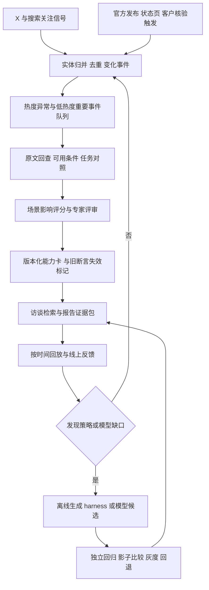

# 技术时效性与重大变化监测：FDE-Agent 如何持续修正诊断

研究日期：2026-10-03。配套主文：[企业 AI 转型分诊与访谈研究](../FDE-Agent-企业AI转型分诊与访谈研究.md)。本轮只做研究与设计，未接入监测服务、调用付费 X API、运行模型优化或改造应用。用户举出的新技术名称仅作背景，本研究不核验该例子的具体含义或热度。

**推荐方向：建立“发现变化→确认能力→评估诊断影响→更新受影响资产→带时间回放验证”的闭环。** X 可以成为发现渠道；进入诊断的依据应是经核验的能力与适用条件。知识、harness 和模型分开更新，先做能力卡与检索更新，再研究受评测约束的 harness 优化和模型换版。

本文的评分、权重、阈值、状态与时限均为**本项目设计草案**，尚无历史回放或真实客户效果验证。引用支持方法或接口的存在，不表示来源采用或验证了这套企业分诊方案。

## 1. 问题比知识库“多久更新一次”更深

技术变化影响的是企业的**可行方案集合**。同一任务以前需要定制工程，现在可能有标准产品；以前可用的接口，也可能因停服失效。Agent 即使一直检索新文章，若仍按旧能力边界选择下一问和服务类型，仍然会过时。

| 变化层 | 可能怎样影响诊断 | 需要更新什么 |
|---|---|---|
| 能力 | 原本做不了的任务变得可行；某类错误仍未解决 | 任务能力卡、反例、必须核验的条件 |
| 经济与性能 | 在同等质量下，成本、延迟或资源跨过客户可接受边界 | 对比数据、总成本口径、低成本替代路径 |
| 产品与部署 | 标准产品覆盖新场景；私有部署、接口、地域可用性改变 | 产品能力和适用范围、集成追问 |
| 失效 | API 停服、破坏性变更、支持终止或已验证能力被撤回 | 失效标记、旧建议撤回、受影响案例复诊 |
| 执行与推理 | 当前模型或工具无法可靠理解新材料、调用新接口 | 工具适配、harness 校验；必要时比较模型 |

“医学变化相对慢”在这里是用户提出的产品背景，本文不作医学知识更新速度的实证比较，也不推断医疗系统无需更新。FDE-Agent 更需要根据**具体断言的变化速度与错误影响**分配核验频率。

从现有代码能确认：`fde_agent/knowledge.py` 采集本地资料并通过 `ingest()` 持久化，检索格式没有事实有效期；`config.py` 通过配置选择模型；`app.py` 缓存加载资源。未见技术变化雷达、定时核验、能力替代链或换版评测。相同模型别名可能对应供应商更新后的服务，因此“配置静态”也不等于“底层行为永远不变”。未来应记录供应商返回的版本标识（若提供），并用固定样例探测行为漂移。

## 2. 已有方案能解决哪一段

| 路径 | 核验到的依据 | 能解决什么 | 对本产品的不足与选择 |
|---|---|---|---|
| 定期更新知识与 RAG | FreshQA 项目维护带日期的数据链接和历史版本；FreshPrompt 有搜索增强入口 | 让外部事实不受模型训练截止日限制 | README 的更新承诺不能证明当前新鲜；检索新文也不能证明判断已更新。作为基础路径 |
| 回答时联网核验 | X 计数文档确认时间窗口查询；GitHub 可查发布记录 | 在关键选型时核对当前供给 | 单次搜索可能遗漏未命名新技术；开销与响应延迟高。与后台雷达结合 |
| 突发／漂移检测 | River ADWIN 比较自适应窗口内的统计变化 | 检测热度或运行质量分布改变 | 分布变化不等于业务重要；社交序列有季节性、相关性与采集变化，不能照搬统计保证 |
| 离线优化 harness | DSPy 支持模块化流程与提示词优化；GEPA 使用执行轨迹和语言反馈提出提示词更新 | 针对已识别失败修正提问与策略候选 | 优化器不会自动建立真实的新技术事实；需独立测试与人工审核，禁止优化掉控制边界 |
| 评测后换基座模型 | 本项目可在同一证据包和任务下比较候选 | 补足可重复的推理／工具使用能力缺口 | 新模型仍可能缺知识、改变输出格式或变贵。不能用发布时间、榜单代替企业访谈评测 |
| 持续训练 | 不纳入本项目路线 | — | 沿用主文“不训练模型”要求；反馈进入知识、规则和评测 |

机制依据：[FreshQA 项目](https://github.com/freshllms/freshqa)（F02）、[X Counts](https://docs.x.com/x-api/posts/counts/introduction)（F05）、[GitHub Releases](https://docs.github.com/en/rest/releases/releases)（F07）、[ADWIN 文档](https://riverml.xyz/latest/api/drift/ADWIN/)（F11）、[DSPy](https://github.com/stanfordnlp/dspy)（F12）与 [GEPA 论文摘要](https://arxiv.org/abs/2507.19457v2)（F13）。这是一项组合设计推论，尚未验证端到端效果。

## 3. 变化雷达的数据源与覆盖策略

### 3.1 X 的“爆火 index”应自行构建，不预设平台已有合适指标

本次没有确认 X 提供一个能直接判断“FDE 重大变化”的现成指数。已读官方文档确认：

- Post Counts 返回查询匹配帖子在时间桶里的数量，不返回正文；recent 窗口为过去 7 天，支持分钟、小时、天粒度，完整历史计数有不同访问要求。
- Filtered Stream 可按规则接收近实时帖子；规则可按关键词、用户等筛选，文档展示了排除转发的查询方式。
- **Counts 不提供独立作者数、质量或实测结论；文档还提醒 counts 与搜索结果的过滤口径可能不同。** 这些统计必须分开计算和标注，不能把抓到的样本作者数当全量作者数。

依据：[Counts 原文](https://docs.x.com/x-api/posts/counts/introduction)、[Filtered Stream 原文](https://docs.x.com/x-api/posts/filtered-stream/introduction)。本轮未调用接口；可购权限、费用、实际覆盖和历史回填能力须在接入时核对。不把网页可读视为 API 已可用。

**工程上的直接约束：7 天 recent 不能直接建立 28 天基线。** 要么从接入日起持续保存同口径统计，要么取得历史权限。冷启动期间使用同类技术的基线与人工排序，明确低置信状态；数据断档不能填成 0。

### 3.2 补充源与独立性

| 来源 | 本轮核验状态 | 适合的用途 | 偏差／接入限制 |
|---|---|---|---|
| 官方 changelog、状态页、产品文档 | 按目标供应商逐项接入；当前只核验了下述 GitHub 接口 | 确认版本、可用日期、破坏性变更；低热度重要事件主通道 | 厂商声明仍需任务验证；页面可能静默改写 |
| GitHub Releases API | 已读官方正文 | 保存发布说明、`published_at`、`draft`、`prerelease` 等字段 | 普通 tag 不一定在 releases 中；发布不等于可用或企业成熟 |
| Google Trends Trending now | 已读官方正文，说明可导出 CSV／RSS | 观察公众搜索关注变化，补 X 覆盖 | 是搜索需求，非技术效果；并非所有垂直新技术进入榜单 |
| GDELT | 已读官方数据说明 | 发现新闻事件、扩展语言与地区覆盖 | 新闻重复与事件分类噪声大；转载不能变成独立验证；首版可后置 |
| Hugging Face API／model cards | 本次访问超时，候选未核验 | 后续核对模型发布、配置和许可线索 | 暂不主张具体 trending 接口、排行口径或权限已确认 |
| 实测、用户反馈、专家复核 | 本项目须自行建立 | 判断新能力是否真能改变业务条件 | 有选择偏差；记录任务、数据、环境和失败样本 |

已核验来源：[GitHub Releases](https://docs.github.com/en/rest/releases/releases)、[Google Trends 帮助](https://support.google.com/trends/answer/3076011?hl=en)、[GDELT 数据说明](https://www.gdeltproject.org/data.html)。不依赖 GDELT 页面上带有旧时间表的服务承诺，只采纳数据类型与查询方式说明。

### 3.3 不只盯住已知模型名

按“首发业务任务→能力缺口→技术类别”建观察清单，例如长文档核验、异构表单提取、跨系统操作、可本地运行的推理。实体字典包含技术名、别名、仓库和版本，未知名称可以从任务关键词和选定维护者的信息中发现，再由证据归并确认。

同名不同项目不能合并，不同版本不能一概沿用旧结论。聚类依据原始发布、仓库、版本与链接关系；相似语义只帮助提出归并候选。记录转发链、同组织作者和营销来源，承认无法可靠识别所有机器人。**一份厂商公告被转载百次，仍是一份能力声明。**

## 4. 怎样定量判断“重大变化”

### 4.1 先明确对象与真值

判定对象是“技术事件 e 对业务场景 c 的影响”，不是技术名称的永久等级。重大变化至少改变一个决策变量：可行任务、质量／成本／延迟可接受性、可选标准产品、部署与集成条件、必要专家类型、关键追问、继续或停止的边界。

分开标注：**领域重大变化**（影响首发场景中的一组任务）和**客户重大变化**（只对某客户的决定性约束重要）。即使不改变 R0–R5 的路线，只改变下一问、验证动作或最低投入，也可能有价值；换了产品名但判断没有变化，不算重大。

真值由独立专家结合发布证据和任务结果标注，保存分歧与理由。评测用的“重要事件全集”还要从官方发布、历史停服与客户记录独立收集，不能只取雷达抓到的候选，否则永远看不到漏报。

### 4.2 第一级：量化热度异常，只决定研究优先级

先选固定来源、固定查询版本和时间桶。以日桶为起点，保存原始 counts 与去重样本两种序列；基线只能来自事件发生前的观察。建议同时保存绝对数量、技术类别内份额、独立作者样本与转载集中度，分别监测。

对一条口径固定的量序列 x，可用透明的初版统计：

```text
y_t = ln(1 + x_t)
m_t = median(y_{t-28}, ..., y_{t-1})
d_t = median(|y_i - m_t|), i ∈ [t-28, t-1]
z_t = (y_t - m_t) / max(1.4826 × d_t, 0.2)
growth_t = (x_t + 5) / (median(x_{t-28}, ..., x_{t-1}) + 5)
```

0.2 是分母下限，5 是小样本平滑常数，均须回测；`z_t` 是异常强度，**不是概率或通用显著性检验**。已有同星期／时段规律时改用季节性基线。针对全平台流量变化，另监测同源技术类别内的占比序列；无法取得同口径分母时不计算份额。

初版可试“`z≥3` 且 `growth≥3` 且日计数≥30”进入异常候选，重要作者或新实体另开冷启动队列。它不是能力确认阈值；低数量异常、名称歧义和采集变化必须标记。不要跨来源相加原始数量，或让一条爆款贡献所有质量判断。

**合成算例**：此前每日中位量为 20，今日 100，历史 log-MAD 为 0.2，则 `z≈5.30`、`growth=4.2`，满足候选条件；此前每日 0、今日 2，即使相对增长明显，也不因此成为重大事件。上述数字是公式演示，不是真实 X 数据。

可在积累数据后比较滚动分位数、EWMA、变点检测和 ADWIN。ADWIN 的官方实现支持自适应窗口漂移检测，但本产品需要处理自相关、采样断档、多实体同时检测和重复告警；应回放误报与检测延迟，不宣称直接继承文档中的数学保证。见 [River ADWIN](https://riverml.xyz/latest/api/drift/ADWIN/)。

为防漏报，官方停服、接口破坏性变更与客户触发核验**绕过热度门槛**；为防刷量，热度再高也不能绕过下一层证据门槛。用事件指纹与版本去重、设置告警冷却；新证据或可用状态改变时重新开案。

### 4.3 第二级：证据门槛与诊断影响分开

证据状态不伪装成模型自信概率：

| 状态 | 已确认什么 | 允许的产品动作 |
|---|---|---|
| E0：线索 | 社交讨论或二手报道 | 进入研究队列，不能用于确定推荐 |
| E1：发布可回查 | 有原始发布及日期，能定位承诺 | 记录候选与待核验条件；不写成已可用 |
| E2：可用条件已核验 | 核对实际版本、访问、部署和相关限制 | 可有条件介绍选项，声明尚未确认客户任务效果 |
| E3：相关任务已验证 | 有可回查、适用任务与环境的测试，保留失败 | 可作为更新诊断依据的候选，经评审后发布 |

对停服或接口失效，原服务的明确失效证据可直接触发限制旧推荐，不必等待新方案达到 E3。官方未来下线公告则记录生效日期与提前迁移动作，不能误写为“今日已不可用”。

在证据门槛之外，对四项影响各打 0–4 分：

| 因子 | 0 分 | 2 分 | 4 分 | 应绑定的证据 |
|---|---|---|---|---|
| G：任务可行性改变 | 仅换名称／演示，无相关增益 | 受限任务新增可行步骤 | 目标任务由不可行变为可行，或旧任务能力明确失效 | 固定任务、成功标准、旧新对照与失败样本 |
| Q：业务约束跨越 | 未测量或不改变可接受性 | 改善明显但是否达标仍待确认 | 在同等必要质量下跨过已知成本／延迟／资源边界，或反向失效 | 统一质量门槛、完整成本口径、延迟分布与环境 |
| S：选项替代程度 | 旧路径仍同样合适 | 改变局部定制范围或实施工作 | 标准产品替代主要定制环节，或需要重新选择服务路线 | 功能覆盖、迁移与维护负担、原路径反事实 |
| A：实际可采用性 | 无访问或不满足硬约束 | 可测试，但部署／集成仍有限 | 满足目标场景的访问、部署、集成和维护条件 | 可用版本、部署条件、接口与运维责任 |

1／3 分表示介于相邻锚点之间，必须写理由；未知不自动填 2 分，应给上下界或标为待补证。证据门槛和客户硬约束仍单独决定动作。

```text
I(e,c) = 25 × [0.35G + 0.30Q + 0.20S + 0.15A]  # 0–100
R(e,c) = 场景相关度；可先用 0 / 0.5 / 1 三档，分别写匹配依据
```

初版将 `I≥70`、`R=1`、达到 E3 且硬约束无冲突的正向事件列为“重大变化评审候选”；`40≤I<70` 进入限定场景跟踪。硬约束包括任务所需部署、数据边界和实际访问条件；不能通过加权得分抵消。客户级硬约束翻转和负向失效事件可越级处理。**70、权重和分档都是试验起点；专家审核后的决策影响才是最终标签。**

### 4.4 五个合成案例验证定义是否合理

| 事件与场景 | 热度／证据 | 影响判断 | 应做什么 |
|---|---|---|---|
| 新能力使常见表单任务达到要求，标准产品覆盖原需定制部分 | 热度高，E3；G=4、Q=4、S=3、A=2，I=87.5；相关度 1 | 可能重大，但仍须确认部署硬约束 | 修改替代路径问题；重新比较 R1／R3／R4，不自动宣布无需 FDE |
| 发布演示刷屏，实际不可取得，尚未做任务对照 | 热度高，E1 | G／Q 未知，A=0；不足以确认重大 | 进入跟踪，不改变确定推荐 |
| 长期低讨论 API 宣布并确认即将停服，客户已依赖 | 热度低，原始公告可回查 | 客户级重大负向变化，有未来生效日 | 提前重启相关选项评审；到期禁止沿用“当前可用”断言 |
| 某任务质量提高一点，原方案已达标，成本与维护无改变 | 热度中，E3；G=1、Q=1、S=0、A=4，I=31.25 | 常规更新；不改变分流 | 更新能力细节，不追加无关访谈负担 |
| 很强的新模型仍无法解决例外折扣不记录、审批责任冲突 | 可用且强，但当前阻塞与模型能力无关，R=0 | 对此客户不构成诊断重大变化 | 保持 R2，先对齐流程和责任 |

分诊影响通过**同一企业事实、同一目标与约束下的变化前后回放**检查。新事实先改变能力与替代方案，再看哪一问和结论应变；不能把“模型提出了不同路线”当作新技术的真实效果。

为了避免影响评分只是主观打分，给每个首发业务域固定一组代表场景，另算**决策影响覆盖率**：

```text
M_j(e) = 1：验证后，事件使场景 j 的可行选项、必要投入、关键追问或分流有实质变化
         0：确认无实质变化；未知单列，不冒充 0
D(e) = Σ(w_j × M_j(e)) / Σw_j
```

场景权重 `w_j` 在评审事件之前按目标用户覆盖和业务影响设定，不能因某个新技术擅长某题就事后提高该题权重；未知场景保留在总分母中，并分别报告 D 的已确认下界与把未知视为改变时的上界。`M_j` 的依据是实测条件与独立专家确认，不是被测 Agent 改了说法。

例如固定 20 个等权场景，4 个确认需要改变、14 个确认不变、2 个未知，则 D 的区间为 20%–30%，并报告是哪 4 个、改变什么。还应单列“原不可行→可行”的任务数、“原可行→失效”的任务数和方案总成本变化；同一场景的多个改变只计一次。这个比例帮助区分领域影响广度；只有一个客户受影响时，也可能构成该客户的重大变化，不能用低 D 掩盖。

场景中的质量、延迟和成本边界必须预先定义，用同样的数据、环境与必要复核步骤测试旧新方案，报告样本量和不确定性。无法确认跨过边界时维持待定。可将“D 下界达到 20% 且通过证据／硬约束检查”作为领域重大变化的另一项试验门槛，与 I 评分共同回测；20% 同样不是已验证标准。D 衡量覆盖，I 衡量影响强度，两者分开报告。

### 4.5 怎样把草案校准成有用指标

先由至少两位独立评审者标注一批历史事件：重大正向、重大负向、常规更新、炒作／不可用、客户不适用。分歧保留为区间或待补证，避免强造唯一答案。

按时间、技术实体和首发业务域划分开发／校准／测试集；同一发布的转载不得分到不同集合。比较“纯热度”“纯官方发布”“热度＋证据＋影响”三种策略，在**相同审核预算**下测重要事件召回、Precision@K、每周误报、漏报损失等级、发现延迟。抽查未入选与低热度样本，防止筛选偏差。

调权重、阈值和每日审核容量时优先符合漏报与误报的业务代价，不追求一个漂亮总分。样本足够后才研究学习排序或校准预测；重要性分数仍不替代硬约束与证据审核。

## 5. 怎样更新知识、harness 和模型

### 5.1 最小架构



首版可用定时任务、关系表／JSON、已有检索和审核队列；事件规模与实际检索需求明确后再选复杂流处理或图数据库。监测状态、审核积压和断档同样要入库。

### 5.2 最少保存两种卡片

**变化事件卡**记录：`event_id`、技术实体／版本、事件类型、原始发布与独立验证链接、`published_at`、`effective_at`、`first_seen_at`、去重链、采集口径版本、覆盖／断档、原始指标、异常强度、证据状态、评分分项及理由、影响业务域、审核动作与负责人。没有生效日期时保留未知，不能借发布时间补全。

**能力卡**记录：`capability_id`、任务与适用条件、已测能力和失败、服务／模型版本、部署与数据约束、质量与成本口径、来源 ID、`valid_from/to`、`verified_at`、`review_due_at`、替代／失效关系、依赖的访谈问题与分流规则、状态、卡片版本。

`published_at` 是来源发布时点，`effective_at` 是技术变化生效时点，`first_seen_at` 是系统观察时点；`verified_at` 是本系统确认某断言的时点。区分现实有效时间与系统获知时间，才能按历史时点回放。新网页更新时间不能覆盖旧事实有效期；删除旧卡会破坏审计，应用失效状态与替代关系。

### 5.3 更新时机与触发

以下频率是试用配置，不是公开服务承诺：

| 断言类型 | 起始策略 | 何时额外核验 |
|---|---|---|
| 访谈原则、流程方法 | 季度审核或有反例时更新 | 用户纠正／专家复核指出问题 |
| 技术任务能力、标准产品覆盖 | 每周检查来源；发布事件触发 | 进入选型、对能力边界有关键争议 |
| 价格、部署、访问与接口支持 | 每日监测相关变更；关键推荐前复核 | 客户决定依赖这些条件时 |
| 下线、破坏性变更与能力撤回 | 官方事件直接进入高优先级队列 | 确认生效后立即限制旧断言，不等常规周审 |

可先设一般重要事件 72 小时内完成处置，确认失效后 24 小时内限制旧推荐；统计达标率及 P95，不承诺在证据缺失时限内获得 E3。未能验证时的合格处置是“明确待核验并停止依赖旧断言”，不是强行确认新能力。

按需联网只发生在能改变建议的技术条件上，研究查询只带通用任务和约束，不把客户敏感材料默认送给公共渠道。外部帖子是资料，不能获得修改策略、安装插件或执行代码的权限。测试新能力使用脱敏或合成任务；证据无法取得时，允许 `needs_evidence`。

### 5.4 知识与 harness 的发布路径

自动化先负责采集、去重、统计、起草卡片、标出影响依赖和运行回归；专家确认能力结论与重要策略变化。对结构化官方失效信息，未来可以审核过规则的自动限制旧推荐，但恢复／替代仍需验证。

知识更新不能只加向量：检索先按状态、有效期和任务约束过滤，再相关性排序；技术能力引用绑定卡片版本，并检查旧卡是否已被替代。事实越新并不自动越可靠，稳定方法不应因发布日期旧被丢弃。

harness 变更包含新的关键追问、方案比较步骤、检索或工具适配。DSPy／GEPA 只作为离线候选生成路径；限定可改字段，不允许修改权限、发布条件和不可编造规则。候选先跑原有多轮评测与新时效案例，再由独立审核决定是否发布。见 [DSPy README](https://github.com/stanfordnlp/dspy)、[GEPA README](https://github.com/gepa-ai/gepa)；本轮没有审计其全部源码或复现效果。

### 5.5 模型换版与版本固定

对候选模型固定知识快照、工具、客户情节、输出契约和预算，测问题发现、证据忠实度、约束识别、纠错、分流、时效案例、费用与端到端延迟。跨多次运行报告差异，防止把随机波动当收益；公开排名只作候选线索。

采用消融比较：旧系统、仅更新知识、仅更新 harness、仅换模型，以及最终组合。这样才能确认收益来自哪个变化，或暴露兼容问题。供应商别名静默换底层模型时，也运行固定探针与回归；拿不到固定版本就记录这个复现限制。

发布清单记录 `(知识版本, harness版本, 模型标识, 工具版本, 评测集版本)`，逐项可回退。一场访谈固定清单；新知识在下一场使用。当前访谈遇到影响已给建议的重大失效时，显式暂停该结论、说明新证据，再有记录地切换与重评，不能后台悄悄换条件。

只在客户重新访问、回访获授权或原有服务约定允许时提示复诊；本轮不建立对外自动通知。内部先标记受影响报告、需要重核验的依据和替代动作。

## 6. 时效性 T 怎样评测

### 6.1 时间正确与决策正确都要测

T 是项目新增维度，**不是官方 GAPS-T 标准**。事实忠实度仍必要，但还要判断当前证据是否改变这位客户的可行选项。分别测：

- **发现链路**：在回放的数据覆盖和时间限制下，能否发现重要事件、完成适用处置？
- **诊断链路**：把截至 t 的正确证据包给定后，是否问对新增条件、改变该变的判断、保持不该变的判断？

分别报结果才能区分漏采、核验积压、检索失效与推理问题；一个总分无法定位故障。

| 指标 | 定义 | 必须一起报告 |
|---|---|---|
| 及时重要事件召回 | 时限内发现并完成适用处置的独立真值重要事件／全部真值重要事件 | 正向／负向、来源覆盖、冷启动与审核积压 |
| Precision@K／误报 | 固定审核容量前 K 个候选中的重要比例；每周不重要告警数 | K、审核成本、未入选样本抽查 |
| 过时建议率 | 依赖已失效事实或遗漏决定性新选项的案例／需要当前技术依据的案例 | 错误影响等级，不把每个未提及新产品都算遗漏 |
| 正确更新率 | 应改变的案例中，按新证据正确改变追问／方案／分流的比例 | 路线改变与其他有意义更新分开 |
| 无关变化稳定性 | 不应改变的案例中，保持正确判断的比例 | 高热度不适用、常规更新、流程阻塞三类 |
| 证据核验覆盖 | 有适用版本、核验时间与直接支持证据的时效敏感结论／全部这类结论 | 证据真实支持，不只字段非空 |
| 端到端时延 | 生效或公开披露→发现→核验→处置／可供诊断使用，各段 P50／P95 | 未来生效公告单列提前量；漏报未完成事件列为未达标，不从时延统计中消失 |
| 撤回时延与事件成本 | 确认旧能力失效→限制旧推荐；每个确认事件的采集、测试、审核成本 | 每周总预算、积压与回退次数 |

建议初版发布门槛：定义过的重要失效案例不得继续确定推荐失效能力；未来承诺不得写成当前可用；高热度不适用与常规更新不得导致无依据改判；所有时效敏感技术断言须能回查版本与核验依据；原有访谈纠错与高影响责任检查无重大退步。这是测试门槛，不代表真实环境零错误。

### 6.2 首批 10 组回放题

每组包含同一企业事实、变化前快照、变化后证据、应变条件、允许不变的部分、必须追问和不可编造项；不是只问“知道最新模型吗”。

| 组别 | 注入的技术事件／采集条件 | 预期行为 |
|---|---|---|
| 1 | 标准产品达到固定任务要求，原定制路径不再唯一 | 比较 R1 与原路径，说明集成和维护余量 |
| 2 | 社交爆火但无可用服务或只有发布承诺 | 保留候选状态，不将承诺当事实 |
| 3 | 新能力强，但客户必须的部署条件不支持 | 不因能力分高而推荐；追问约束是否可调整 |
| 4 | 低热度 API 停服，给出真实或合成生效日期 | 绕过热度门槛，提前标记迁移，到期限制旧推荐 |
| 5 | 同质量下总成本跨过客户可接受边界 | 更新投入判断，同时计入复核与迁移成本 |
| 6 | 提升幅度小，现有任务和方案已达标 | 判断保持稳定，不给用户增加无关负担 |
| 7 | 旧闻重发／同名技术／多站转载 | 不伪造新变化或重复独立证据 |
| 8 | 厂商宣称可用，适用任务实测失败 | 保存反证，限定能力，不无条件降级为自助 |
| 9 | 新模型出现，但核心问题是权责与例外规则 | 保持流程优先路径 R2 |
| 10 | X 断流、计数口径变更或来源相互冲突 | 标记覆盖与待核验，不把缺数据解释为无重大事件 |

回放按时间冻结网页内容、事件证据、基线、可检索卡片与参考标签；只使用决策时点以前的数据，未来生效公告按当时可知内容处理。模型可能在训练中见过后来的事实，历史结果不能完全排除污染，补充变名合成事件并明确报告；参考结论由独立专家审核，不让被测模型自造真值。

## 7. 建议实施顺序与仍需验证的问题

| 阶段 | 具体产物 | 进入下一阶段的依据 |
|---|---|---|
| P0：定义与回放 | 选 1–2 个业务域；事件／能力卡规范；独立标注集；10 组题的多轮版本 | 专家能解释哪些变化影响判断，数据窗口与标签无泄漏 |
| P1：最小监测闭环 | 官方发布与状态监测；可选 X 计数／正文样本；审核队列；能力卡有效期与撤回；推荐前按需核验 | 相同审核预算下，优于纯热度或纯发布基线；关键负向事件不依赖热度 |
| P2：自动化与优化 | 自动起草卡片、定位受影响问题与规则；离线 harness 候选与模型对照 | 时效收益明确，旧访谈质量不退步，灰度与回退可用 |

试用容量可以先设每日 20 个浅筛候选、每周 5 个深度验证事件作为预算上限，按实际审核成本调整；这是设计参数，不是已估出的真实吞吐。预算耗尽时记录积压，并为失效事件预留容量，不能静默丢弃。尚无 X 账号权限、采购费用或目标用户覆盖数据，暂不列未经核验的金额。

仍需验证：X 对首发业务域的重要事件覆盖率；社交异常领先官方可用证据多久；技术改善是否改变企业任务；专家评分一致性；官方来源外的漏报；每个确认事件的审核成本；自动优化能否改善分诊而不诱导更多转介。以这些数据决定是否扩大来源或引入复杂排序，不先建设全网新闻系统。

## 8. 本次来源与阅读边界

网页检索工具未取得可用结果；改用只读公开 HTTP 读取。下表按实际取得的正文登记；不在仓库保存抓取全文。资料目录和机器可读记录同步增补，编号 F01–F16。

| ID | 来源 | 本次阅读范围／状态 |
|---|---|---|
| F01 | [FreshLLMs 论文](https://arxiv.org/abs/2310.03214) | 超时；未取得论文正文，不引用实验成绩 |
| F02 | [FreshQA README](https://github.com/freshllms/freshqa) | 已读 README；未读取表格题目、运行 FreshPrompt／FreshEval；可见版本日期不能证明当前持续更新 |
| F03 | [Kleinberg burst detection](https://www.cs.cornell.edu/home/kleinber/bhs.pdf) | PDF 与论文入口超时；候选方法，不作为已读算法依据 |
| F04 | [X Search](https://docs.x.com/x-api/posts/search/introduction) | 超时；不据此确认 Search 具体限制 |
| F05 | [X Post Counts](https://docs.x.com/x-api/posts/counts/introduction) | 已读端点、粒度、窗口和过滤差异；未调用 API |
| F06 | [X Filtered Stream](https://docs.x.com/x-api/posts/filtered-stream/introduction) | 已读规则、连接、访问分层与编辑历史说明；未连接数据流 |
| F07 | [GitHub Releases API](https://docs.github.com/en/rest/releases/releases) | 已读端点说明与返回示例；未验证目标供应商实际发布覆盖 |
| F08 | [Hugging Face Hub API](https://huggingface.co/docs/hub/api) | 超时；候选未核验 |
| F09 | [Google Trends Trending now](https://support.google.com/trends/answer/3076011?hl=en) | 已读范围、分桶流量说明与 CSV／RSS 导出；未采集趋势数据 |
| F10 | [GDELT 数据说明](https://www.gdeltproject.org/data.html) | 已读数据、查询与更新说明；部分内容时间较旧，未验证全部服务现况 |
| F11 | [River ADWIN](https://riverml.xyz/latest/api/drift/ADWIN/) | 已读算法说明、参数与示例；未读原始论文或运行检测 |
| F12 | [DSPy README](https://github.com/stanfordnlp/dspy) | 已读框架简介与优化路径；未审计源码或复现实验 |
| F13 | [GEPA 论文 v2](https://arxiv.org/abs/2507.19457v2) | 已读摘要与版本信息；未读全文或外推实验提升到 FDE |
| F14 | [GEPA README](https://github.com/gepa-ai/gepa) | 已读核心机制、优化入口和适配概述；不将第三方应用清单和宣传数字视为已核验效果 |
| F15 | [Hugging Face model cards](https://huggingface.co/docs/hub/model-cards) | 超时；候选未核验 |
| F16 | [本项目代码](../../fde_agent/knowledge.py) | 已读知识采集／持久化／检索及配置、缓存相关代码；确认当前缺口，不代表全仓库审计 |
